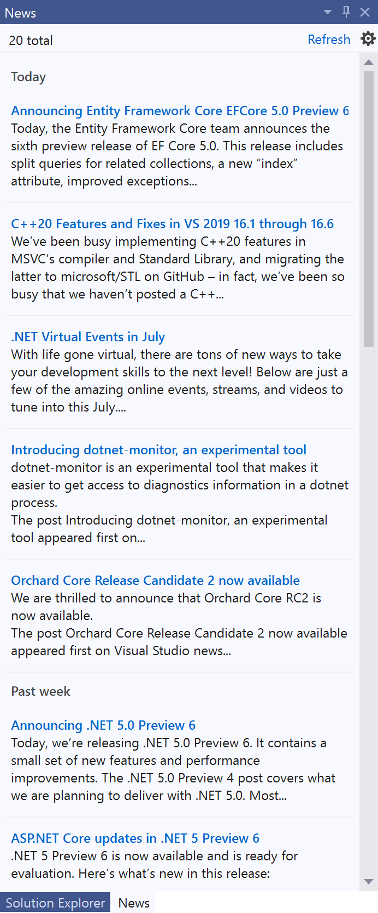
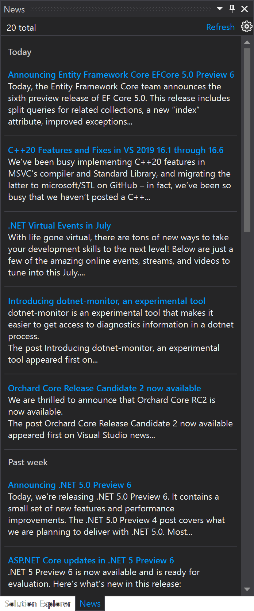

# Daily News in Visual Studio

Shows the developer news from the Visual Studio blog and other sources in a tool window inside Visual Studio.

Download this extension from the [Marketplace](https://marketplace.visualstudio.com/items?itemName=MadsKristensen.KnownMonikersExplorer)
or get the [CI build](https://www.vsixgallery.com/extension/36cfa8d9-bd14-4d32-a8a6-34133aa2309d/).

----------------------------------------------

## Settings

Decide if you want the news to open inside Visual Studio or in your default browser.

## Blue theme

## Dark theme

## License
[Apache 2.0](LICENSE)