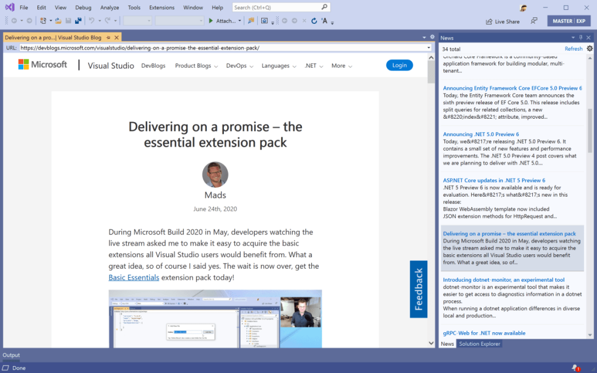
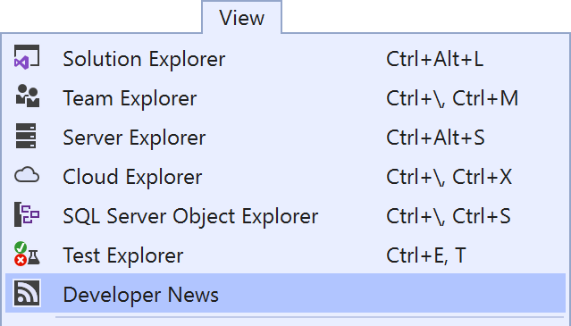
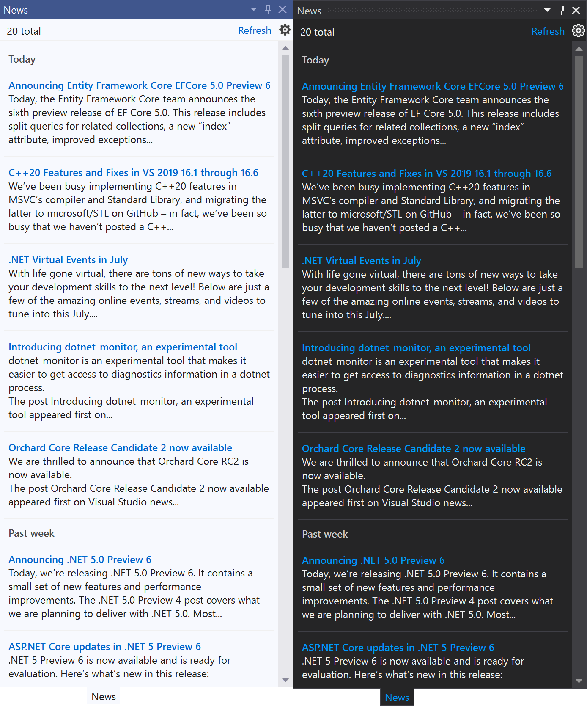
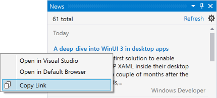
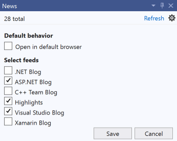

# Daily News in Visual Studio

Always stay up to date with developer news from the Visual Studio team and other sources right within Visual Studio or your default browser.

Download this extension from the [Marketplace](https://marketplace.visualstudio.com/items?itemName=MadsKristensen.KnownMonikersExplorer)
or get the [CI build](https://www.vsixgallery.com/extension/36cfa8d9-bd14-4d32-a8a6-34133aa2309d/).

----------------------------------------------

Get the daily news about Visual Studio and other relevant topics right inside Visual Studio. 

It's simple, it's easy, and it keeps you up-to-date. 

## Open the tool window
Open the *News* tool window from the *View* top level menu.

You can also use the keybord shortcut **Alt + O, Alt + N**. Think of it being short for **O**pen **N**ews.

## Design
The *News* tool window looks great in any theme and looks like a built-in part of Visual Studio.

## Context menu
Right-clicking on any of the posts will show a context menu with various options.

## Settings
Decide if you want the news to open inside Visual Studio or in your default browser. And select the news feeds that are relevant to you.

## License
[Apache 2.0](LICENSE)