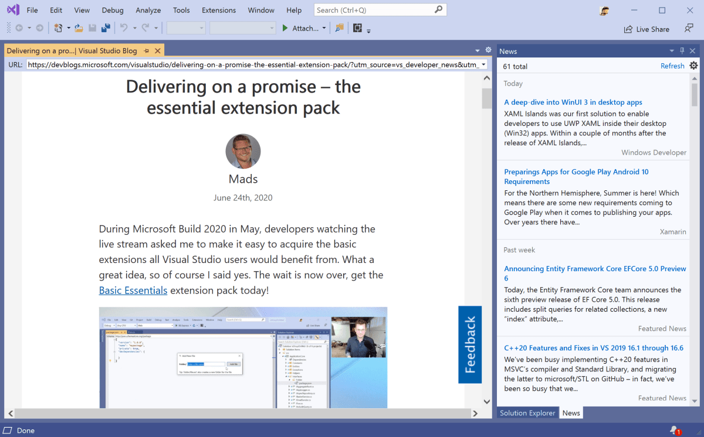
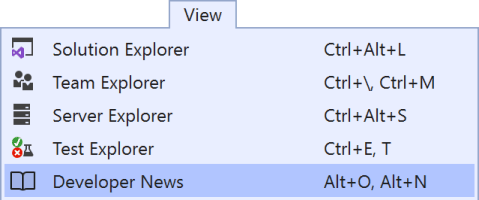
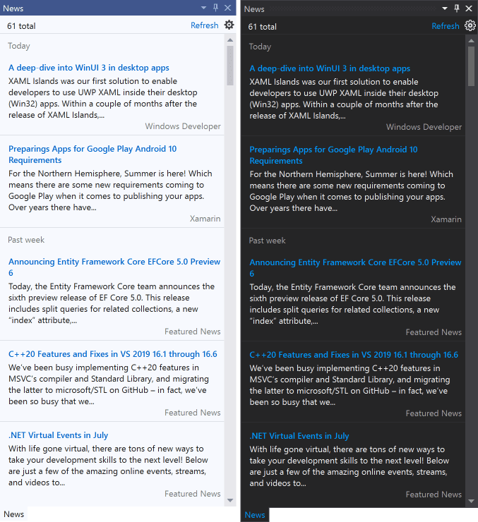
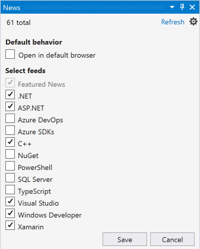

# Daily News in Visual Studio

Shows the developer news from the Visual Studio blog and other sources in a tool window inside Visual Studio or your default browser.

Download this extension from the [Marketplace](https://marketplace.visualstudio.com/items?itemName=MadsKristensen.KnownMonikersExplorer)
or get the [CI build](https://www.vsixgallery.com/extension/36cfa8d9-bd14-4d32-a8a6-34133aa2309d/).

----------------------------------------------

## Open the tool window
Open the *News* tool window from the *View* top level menu.

You can also use the keybord shortcut **Alt + O, Alt + N**. Think of it being short for **O**pen **N**ews.

## Design
The *News* tool window looks great in any theme and looks like a built-in part of Visual Studio.

## Context menu
Right-clicking on any of the posts will show a context menu with various options.

## Settings
Decide if you want the news to open inside Visual Studio or in your default browser.

## License
[Apache 2.0](LICENSE)